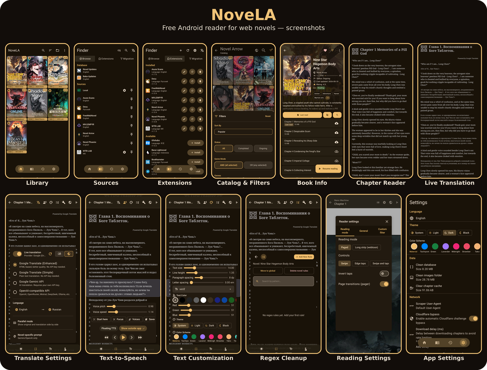

<!--
  android novel reader, web novel app, light novel reader android, epub reader android, ranobe reader, wuxiaworld, royal road, scribble hub, free novel reader, open source novel app
  андроид читалка ранобэ, читалка веб новелл андроид, ранобэ приложение, epub читалка андроид, бесплатная читалка новелл, jaomix, ranobelib
  安卓小说阅读器, 网络小说APP, 轻小说阅读器, 免费小说阅读, epub阅读器安卓, 开源小说应用
-->
<div align="center">


# NoveLA

Бесплатная читалка веб-новелл с открытым исходным кодом для Android.

[🇬🇧 English](README.md) · 🇷🇺 Русский

[](https://github.com/HnDK0/NoveLA/releases/latest)
[](https://github.com/HnDK0/NoveLA/releases)
[](LICENSE)
[](https://github.com/HnDK0/NoveLA/releases/latest)

> ⭐️ **Если вам нравится NoveLA, пожалуйста, поставьте звезду репозиторию!** Это помогает проекту развиваться и мотивирует поддерживать его дальше.

<br/>

</div>

---

## Скачать

**[Получить последний APK](https://github.com/HnDK0/NoveLA/releases/latest)** — требуется Android 8.0+

Или собрать из исходников:

```bash
git clone https://github.com/HnDK0/NoveLA
# Откройте в Android Studio и запустите на устройстве или эмуляторе
```

---

## Возможности

- 35+ источников (встроенные + Lua-плагины)
- Глобальный поиск по нескольким источникам; добавление любой новеллы по URL
- Перевод прямо в читалке с параллельным режимом и индивидуальными промптами — без копирования и переключения приложений
- Бесконечная прокрутка глав с офлайн-кешированием
- Настраиваемые шрифты, размер текста, светлая/тёмная темы (Material 3)
- Озвучка текста с плавающим мини-плеером, фоновым воспроизведением, скоростью/тоном, Bluetooth и поддержкой разных TTS-движков
- Локальная библиотека EPUB и FB2 с пакетным импортом
- Резервное копирование с выборочными настройками и автоматическим бэкапом
- Очистка текста с помощью регулярных выражений (удаление рекламы и вставленного текста)
- Автоматический обход Cloudflare Turnstile
- Перенос новелл между источниками
- Фильтры библиотеки по жанру, источнику и категориям
- Массовая загрузка глав
- Таймер чтения TTS
- 20 языков интерфейса
- Манга-ридер для новелл с изображениями: меню по тапу, кеш страниц с ограничением размера
- Экспорт любой книги в EPUB прямо из экрана глав
- Рейтинги книг с локализованными подписями
- Перевод веб-страниц прямо в читалке через JS-мост (перевод любой страницы внутри ридера)
- Настройки перевода для каждой новеллы отдельно — включение/выключение и языковая пара независимо для каждой книги, входят в резервную копию
- Улучшения читалки: цвет шрифта, межбуквенный интервал, авто-прокрутка, ручная подсветка абзацев и быстрые переключатели
- Библиотека: строка источника на карточках книг (на обложке или под ней) и обновлённые значки обложек
- Перевод или снятие перевода для локальных книг и выбранных глав; пакетная загрузка следующих 100 глав

---

## Перевод

Поддерживается четыре движка. При превышении лимита запросов API-ключи автоматически чередуются по кругу.

| Движок | Стоимость | API-ключ |
|---|---|---|
| Google Translate (Улучшенный) | Бесплатно | Не требуется |
| Google Translate (Простой) | Бесплатно | Не требуется |
| Google Gemini | Бесплатный уровень | Требуется |
| OpenAI-совместимый | Зависит от провайдера | Требуется |

OpenAI-совместимый режим поддерживает OpenAI, OpenRouter, DeepSeek, Ollama, Mistral и любые совместимые эндпоинты.

Параллельный режим отображает оригинал и перевод рядом. Индивидуальные промпты позволяют настроить поведение перевода для каждой новеллы.

---

### Плагины

NoveLA поддерживает внешние плагины источников на Lua, устанавливаемые прямо из приложения.

Официальный репозиторий плагинов: [`HnDK0/external-sources`](https://github.com/HnDK0/external-sources)

Как добавить: **Поиск → Расширения → ⚙️ → вставьте URL репозитория**

---

## Вклад в проект

Любая помощь проекту приветствуется! Вы можете помочь несколькими способами:

- ⭐️ **Поставить звезду** репозиторию — самый простой способ поддержать разработку и помочь проекту расти.
- 🐛 **Сообщить о баге или предложить улучшение** через [Issues](https://github.com/HnDK0/NoveLA/issues).
- 🧩 **Исправить ошибку или добавить новый источник** через Pull Request (для плагинов используйте [external-sources](https://github.com/HnDK0/external-sources)).

---

## Технологии

Kotlin · Coroutines · Jetpack Compose · Material 3 · Room · Jsoup · OkHttp · Coil 3 · LuaJ · Hilt · WorkManager · Android TTS & Media APIs

---

## Лицензия

[GPL-3.0](LICENSE)
